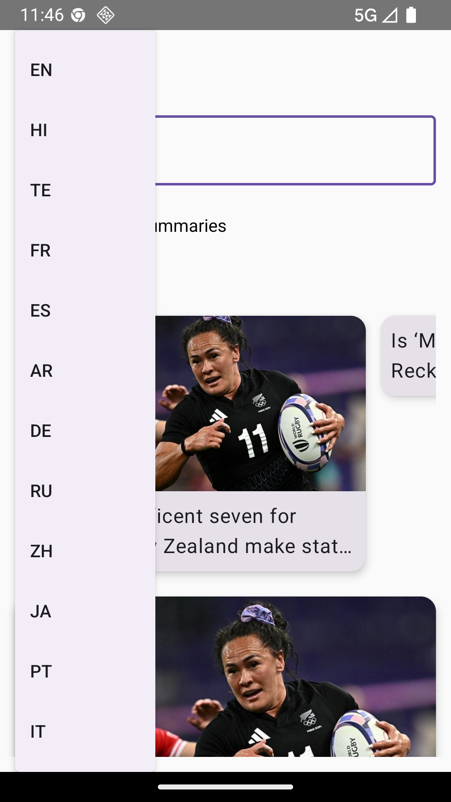
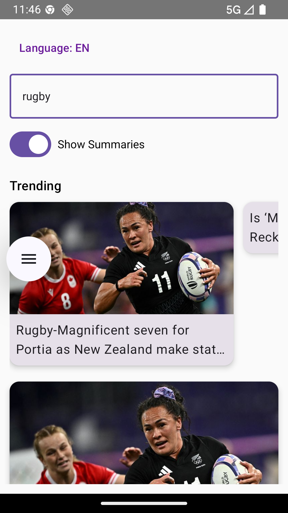
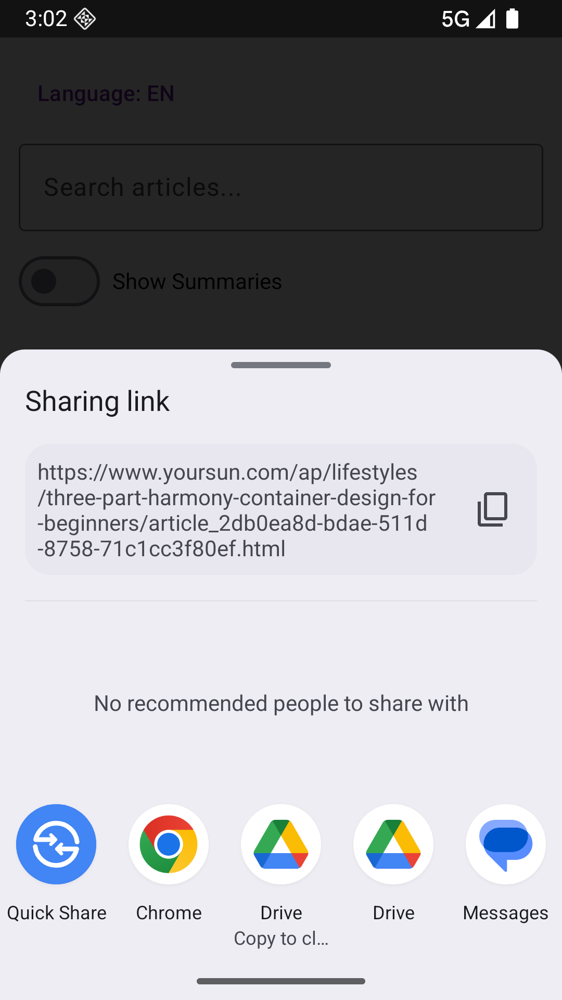
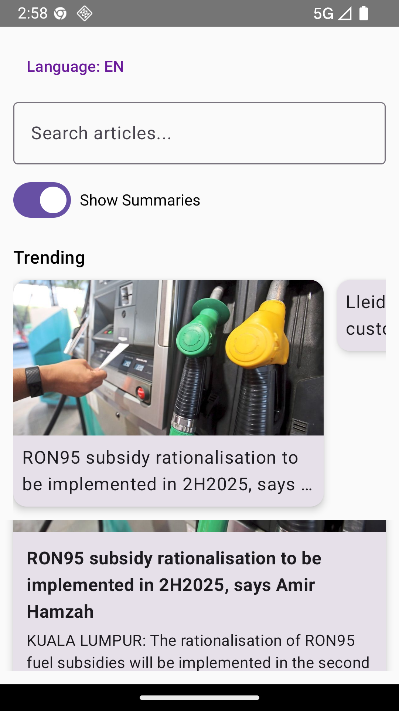
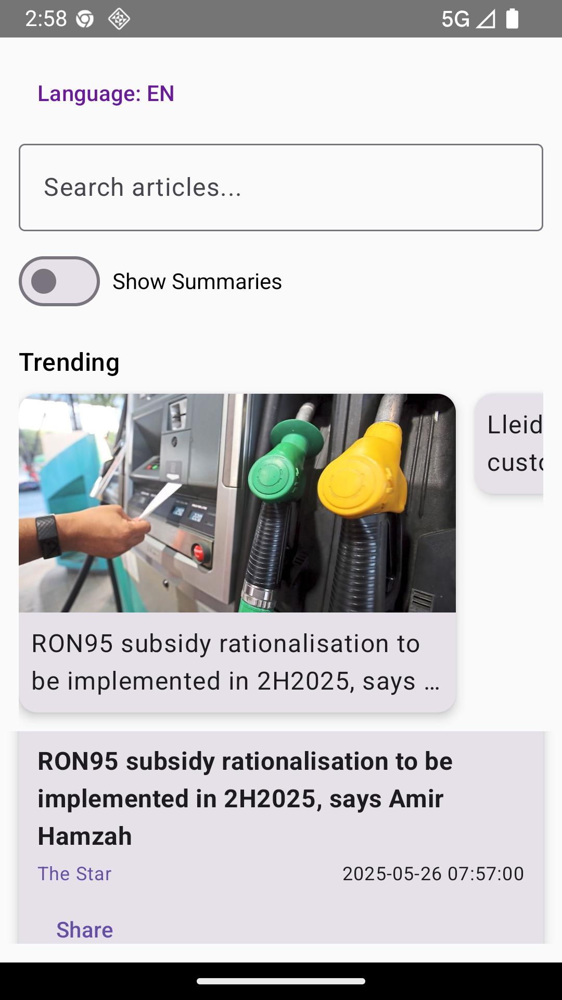

# 📰 Multilingual News Aggregator with AI Summarization

A modern Android app that allows users to search and read multilingual news articles with real-time AI-powered summaries.

---

## 🚀 Features

- 🔍 Search articles across multiple languages.
- 🌐 Language picker with support for 12+ international languages.
- 📄 AI-powered summary toggle.
- 📤 Share news link via apps.
- 🖼 Clean and minimal Jetpack Compose UI.
- 🔁 Real-time news updates using NewsData.io API.
- ⏱ Shows publication time and news source.
- 🧠 Summary toggle per article view.

---

## 🛠 Built With

- **Kotlin** — Core programming language.
- **Jetpack Compose** — Modern Android UI toolkit.
- **Material3** — Adaptive design system.
- **Hilt** — Dependency injection.
- **Room (upcoming)** — Offline caching.
- **Coil** — Image loading.
- **StateFlow** — State management.

---

## 📸 Screenshots

| Language Picker                | Search                      | Share                      | Summary Toggle               | Main UI                   |
|--------------------------------|-----------------------------|----------------------------|------------------------------|---------------------------|
|  |  |  |  |  |

---

## 🛠️ Setup

1. Clone the repository:
```bash
git clone https://github.com/BhavyaMarripudi-1102/MultilingualNewsAggregatorWithAISummarizer.git
```
2. Open the project in **Android Studio**.
3. Add your NewsData.io API key in `MainActivity.kt` or wherever needed.
4. Run the app on your emulator or Android device.

---

## 🔑 API Source

This app is powered by [NewsData.io](https://newsdata.io) — providing multilingual news articles via REST API.

---

## 📄 License

This project is licensed under the MIT License — see the [LICENSE](LICENSE) file for details.

---

## ✨ Author

**Bhavya Marripudi** — Developed with ❤️ using Kotlin + Jetpack Compose.
